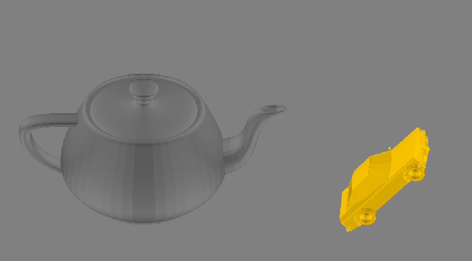

# 3dRenderer
This project was entirely developped with java swing. It is a small app that can render any shapes in 3d even though java swing primarily supports 2d rendering.   
Users can manually create a shape by defining all the triangles that compose it (possible for simple shapes like a pyramid or a cube). Additionally, the app allows the import and rendering of .stl files.   

